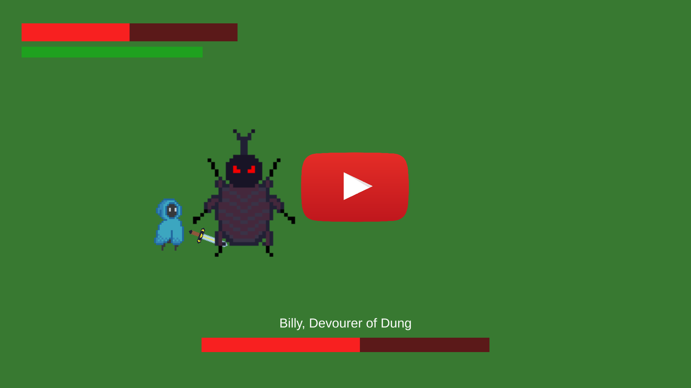
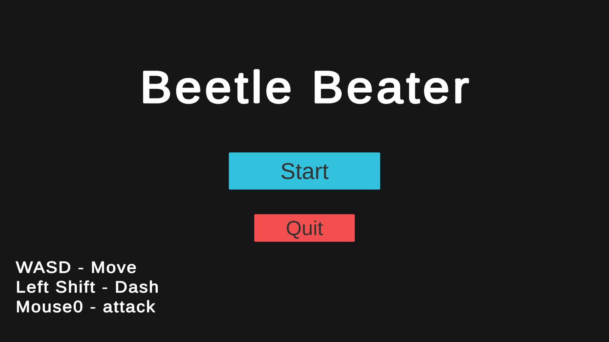
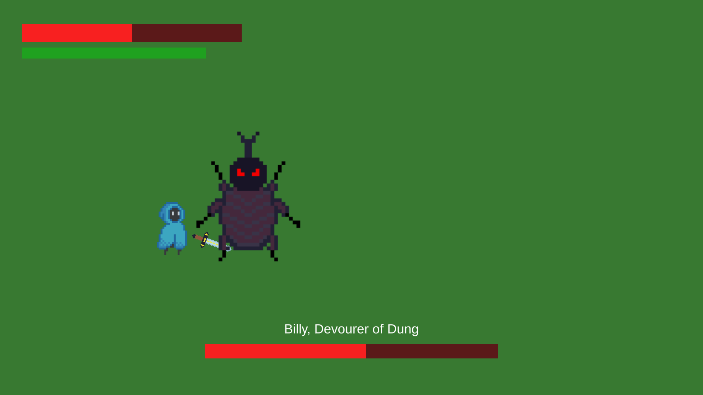
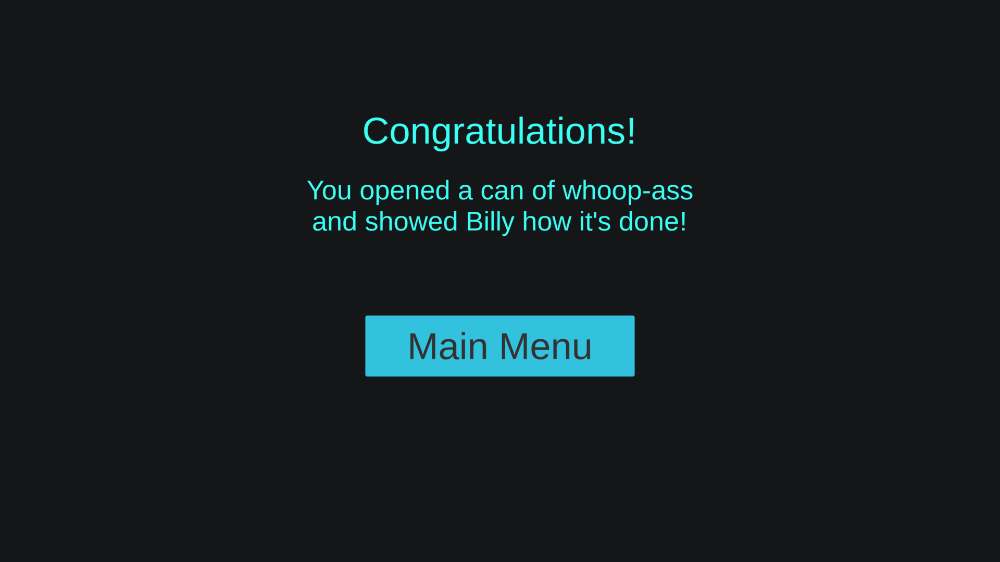

# BeetleBeater
This game was developed during a 45 hour game jam with the theme "bugs" hosted by my study organization. All of the code and sprites were made by me, the audio assets are royalty free assets found online. The background music is credited at the bottom of the description.

Beetle Beater is a souls-like boss fight where the goal of the player is to defeat the boss. The boss has 2 different attacks, a charge attack where the boss lunges towards the player multiple times in a row and a big ground slam dealing damage in an area around the boss. The player needs to dodge these attacks using the dash ability which grants invincibility frames and attack the boss in between boss attacks. Both dodging and attacking cost the player stamina which regenerates over time only if the player is not using their abilities so the player needs to be strategic about which abilities to use when.

The game can be played through your browser on [itch.io](https://bigmonke778.itch.io/beetle-beater).

### Gameplay video

### Screenshots

         

Background music: [Boss Time by David Renda](https://www.fesliyanstudios.com/royalty-free-music/download/boss-time/2340)
